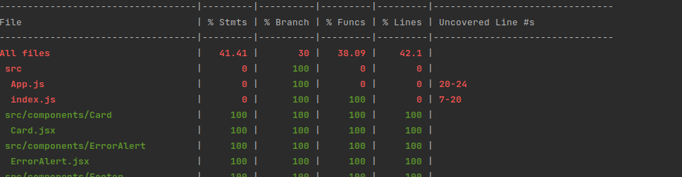

# Imperial destroyers center App
**Note: in order to launch the project it is necessary to have a higher node version equal to or greater than 14. I am using 14.15.
These requirements come from using the latest version of React.!**

## Available Scripts

In the project directory, you can run:

### `npm start` 

Runs the app in the development mode.\
Open [http://localhost:3000](http://localhost:3000) to view it in your browser.

### `npm test`

Launches the test runner in the interactive watch mode.
### `npm test -- --coverage`

Launches the test and get coverage\

**Note: The current coverage is 41%, I could have done more tests to increase the coverage but I preferred to add other features instead**

### `npm run build`

Builds the app for production to the `build` folder.\

### `npm run eject`
**Note: this is a one-way operation. Once you `eject`, you can't go back!**
## Packages used

### React router
It is a framework that creates the routing system of a React application, which I am very familiar with.

### Font Awesome
It is the icon library used in this application

### Axios
It is a framework to make http requests in our application.

###React testing library
It is a library that allows testing the components and also the hooks

## Features
**Filters**

After take a look at the swapi.dev api, I noticed that this api only accepted the query param search and that if filters such as orderBy or the address were added, it would not order the response. That's why I filtered at the front level. In case the api had been prepared, the hooks made would have been simpler since when updating any filter it would call the fetch function and this would return the correct results.

**Get resources**

Instead of using the assets that you have provided me, I have preferred to attack an api that obtains said resources, in case the resource is not available, an image is shown by default

**Themes**

I have made a system with scss variables and a hook called useTheme that allows to exchange between two themes (light/dark)

**internationalization**

I have used react-i18n as a library to implement the internationalization of the application with 2 languages (English/Spanish)
## How I worked

### Folder structure:
- Assets -> (resources like images, ...)
- Components -> (Those elements that are used in the application but do not contain logic and are reusable)
- Config -> (there is a folder with the constants used in our application and another with the scss themes)
- Hooks -> (In this folder we can find the different hooks that are reusable for our application)
- Pages -> All views of our application
- Services -> We find different services such as the api or internationalization
- Templates -> They are components that contain logic that is inside their hook.
- Utils -> this folder contains different files with reusable functions in our application

**API Management:**

I have made a singleton to be able to structure the different endpoints that are attacked in the star wars api. You will also find a file called Rest Api with the different http methods used by axios, which is used in the sigleton

**Hooks**

I have tried to make the hooks agnostic so that they can be easily reused.

**Styles**

I have styled the application through scss since it was a requirement in the test, however I would have used Styled components instead
